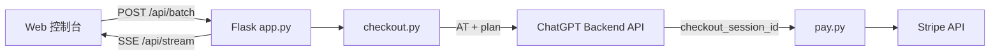

# 黑金控台 · BlackGold Control

**Codex × ChatGPT — ChatGPT Plus / Team 订阅支付编排控制台**

面向 ChatGPT 的暗金风格 Web 控制台：Access Token 批量换 Checkout、Stripe 流程自动化、多线程任务、**SSE 实时日志**、**Docker** 一键部署。社区交流 **QQ 群 432539**。

---

### 为什么 About 里还是「No description…」？

那一块 **只能在你登录 GitHub 之后在网页里保存**，和 README、Git 推送无关。按下面做一遍就会消失：

1. **先登录** [github.com](https://github.com)（必须是你有权限的账号，能打开 [432539/team](https://github.com/432539/team)）。  
2. 打开仓库代码页：[https://github.com/432539/team](https://github.com/432539/team)  
3. 看页面 **右侧栏**，找到灰色小标题 **About**。  
4. 点 **About 这一行右侧的齿轮图标 ⚙️**（在「About」文字右边，不是顶栏 Settings）。  
5. 弹出框里第一项就是 **Description**，把下面**任选一框**整段复制进去；**Topics** 里逐个添加标签（输入后回车）。  
6. 点弹出框里的 **Save changes**。刷新页面后 About 就会显示简介和标签。

若找不到齿轮：把浏览器窗口拉宽（右侧栏被折叠时有时不显示）；或换 Chrome/Edge 无痕窗口重新登录试一次。

**Description** 粘贴（任选其一）：

| 语言 | 复制到 Description |
|------|---------------------|
| 英文 | `Codex × ChatGPT Plus/Team checkout console — batch tasks, SSE logs, Docker. QQ group: 432539.` |
| 中文 | `黑金控台：Codex × ChatGPT 订阅支付编排，PLUS/TEAM 批量、实时日志、Docker。QQ群432539。` |

**Website** 没有可留空。官方说明：[Customizing your repository's profile](https://docs.github.com/en/repositories/managing-your-repositorys-settings-and-features/customizing-your-repositorys-profile)。

**Topics（主题标签）**：在 About 里添加 `chatgpt` `openai` `codex` `stripe` `flask` `docker` `python` `sse`

---

<div align="center">

[](https://www.python.org/)
[](https://flask.palletsprojects.com/)
[](https://www.docker.com/)

**QQ 群：432539**（开源项目交流）

</div>

---

## 这是什么？

**黑金控台（Codex × ChatGPT）** 是一套面向 **ChatGPT Plus / Team** 场景的本地/容器化控制台：通过浏览器访问暗金主题界面，批量录入 Access Token 与银行卡信息，由后端自动完成「AT → 支付会话 → Stripe 流程编排」的一体化任务，并在页面上以 **SSE 流式输出** 展示每一步进度与结果。项目文档与工程迭代与 **Codex** 工具链、**ChatGPT** 生态场景紧密结合，便于社区检索与协作。

适合需要 **多账号批量处理**、**可观测日志**、**可控并发线程数** 的自托管使用场景。

---

## 核心特性

| 能力 | 说明 |
|------|------|
| **PLUS / TEAM** | 支持通过 ChatGPT `backend-api` 创建对应计划的 Checkout 会话（TEAM 含 `team_plan_data` 等必要字段） |
| **批量 + 并发** | 多行 AT 与多行卡号批量配对（卡不足时循环使用），线程池并发可配置（上限保护） |
| **实时日志** | 每任务独立队列，前端默认合并多任务日志并带任务编号前缀，可点选单任务过滤 |
| **代理** | 支持 HTTP 代理（含 `user:pass@host:port` 形式），便于网络环境统一出口 |
| **TLS 指纹** | `checkout` 模块优先使用 `curl_cffi` 模拟 Chrome，降低部分环境下的风控拦截概率 |
| **生产部署** | 提供 `Dockerfile`，默认 `gunicorn` 单 worker 多线程，适合 Linux 容器长期运行 |
| **兼容单链** | 保留单任务 API，可直接传入已有 Checkout 链接执行绑卡流程 |

---

## 技术栈

- **后端**：Python 3.11+、`Flask`、`gunicorn`
- **HTTP**：`requests`、`curl_cffi`（可选但推荐，用于 ChatGPT 侧请求）
- **前端**：原生 HTML / CSS / JavaScript，Server-Sent Events (SSE)
- **支付编排**：自研 `pay.py`（Stripe Checkout / Elements / 3DS 等相关 HTTP 流程）

---

## 架构一览



---

## 快速开始

### 环境要求

- Python **3.11+**（与 Docker 镜像一致）
- 可访问 ChatGPT 与 Stripe 相关域名的网络（**建议自备合规代理**）
- 打码服务：需自行准备 **YesCaptcha**（或兼容接口）API Key

### 本地运行

```bash
git clone https://github.com/432539/team.git
cd team
pip install -r requirements.txt
python app.py
```

浏览器访问：`http://127.0.0.1:5080`

### Docker 部署（推荐）

在项目根目录：

```bash
docker build -t blackgold-control:latest .
docker run -d --name blackgold -p 5080:5080 \
  -e YESCAPTCHA_API_KEY="你的YesCaptcha密钥" \
  blackgold-control:latest
```

默认监听 **`5080`**，与 `Dockerfile` 中 `gunicorn` 绑定一致。容器内需设置 **`YESCAPTCHA_API_KEY`**，否则 `/api/batch` 与 `/api/start` 会返回 503。

---

## 配置说明

### 1. 打码（hCaptcha）密钥

**必须**设置环境变量 **`YESCAPTCHA_API_KEY`**（YesCaptcha 等平台密钥），本地示例：

```bash
# Windows PowerShell
$env:YESCAPTCHA_API_KEY="你的密钥"
python app.py
```

**切勿**将真实 Key 写入代码或提交到 Git。API 地址默认为 `https://api.yescaptcha.com`（见 `app.py` 内 `captcha.api_url`）。

### 2. 批量请求体（Web UI 已封装）

主要字段概念：

- **Access Token**：一行一个
- **银行卡**：一行一条，格式 `卡号|月|年|CVC`（也支持 Tab/逗号分隔解析）
- **计划**：`plus` / `team`
- **代理**：可选，整批任务共用
- **账单地址**：国家/州省/城市/地址行/邮编等，与 `pay.py` 中 locale 逻辑配合

### 3. TEAM 计划说明

`checkout.py` 中 TEAM 使用 `team_plan_data`（如工作区名称、计费周期 `month`、席位数等）。若 OpenAI 侧策略变更，可能需要同步调整 payload。

---

## HTTP API 摘要

| 方法 | 路径 | 说明 |
|------|------|------|
| `GET` | `/` | 返回 Web 控制台页面 |
| `POST` | `/api/batch` | 启动批量任务，返回 `batch_id` 与 `tasks` |
| `GET` | `/api/batch-status/<batch_id>` | 查询批次与各子任务状态 |
| `GET` | `/api/stream/<task_id>` | SSE 日志与结果流 |
| `POST` | `/api/start` | 单任务：直接传 Checkout URL + 单卡信息 |

详细字段以 `app.py` 中解析逻辑为准。

---

## 目录结构

```
.
├── app.py              # Flask 入口、批量任务、SSE
├── checkout.py         # AT → ChatGPT payments/checkout
├── pay.py              # Stripe 侧流程编排
├── templates/
│   └── index.html      # 暗金主题前端
├── requirements.txt
├── Dockerfile
└── README.md
```

---

## 常见问题（FAQ）

**Q：日志里只看到部分任务？**  
A：请使用「显示全部」合并视图；或确认是否多个任务过快结束导致界面未及时切换。

**Q：获取支付链接失败？**  
A：检查 AT 是否有效、代理是否可用、`curl_cffi` 在容器内是否安装成功；TEAM 需满足账号侧开通条件。

**Q：轮询很久仍无明确状态？**  
A：部分卡种或风控下 Stripe 返回状态可能长时间不明确；可适当调大 `pay.py` 中轮询次数或根据日志中的「卡住」提示换卡/换代理。

---

## 开源与合规声明

1. 本项目按 **「原样」** 提供，作者不对使用后果承担任何责任。  
2. 使用者须自行遵守 **OpenAI / Stripe / 发卡行** 等服务条款及所在地法律法规。  
3. **禁止** 将本项目用于盗刷、欺诈、未经授权的支付或任何违法用途。  
4. 欢迎提交 Issue / PR 改进文档与工程化（密钥外置、配置项等），但请勿在公开渠道泄露真实 Token、卡号与打码 Key。

建议在仓库根目录补充 **`LICENSE`**（如 MIT）与 **`.gitignore`**（忽略 `config.json`、`log.txt`、本地密钥文件等），以符合 GitHub 社区常见实践。

---

## 致谢与交流

- **Codex**：开发与文档整理过程中使用 **OpenAI Codex** 类工具辅助，欢迎按同样方式提交 PR 改进本项目。  
- **ChatGPT**：业务侧对接 **ChatGPT**（`chatgpt.com`）Backend API 与 Stripe Checkout，命名与标签中保留 **ChatGPT** 便于搜索。  
- 感谢所有在 **QQ 群 432539** 里反馈问题、共建文档的伙伴。  
- 若你觉得项目有帮助，欢迎在 GitHub 点 **Star** 让更多人看到。

<div align="center">

**BlackGold Control · Codex × ChatGPT** — 批量可控，日志可见，部署简单

社区 QQ 群：**432539**

</div>
